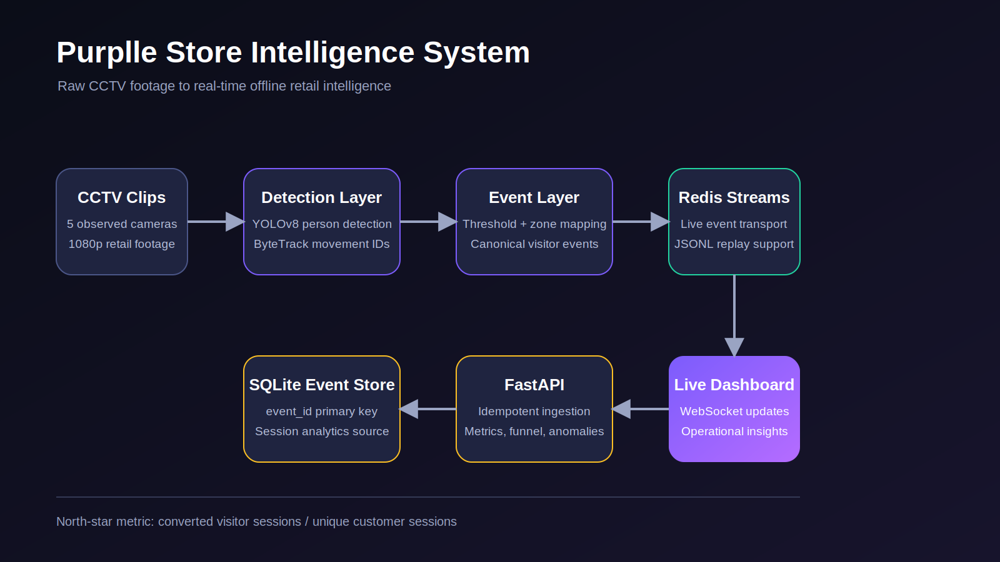

# Purplle Store Intelligence System

An end-to-end pipeline that converts raw CCTV footage into queryable offline
retail intelligence:

```text
CCTV clips
  -> YOLO person detection
  -> ByteTrack movement tracking
  -> threshold and zone events
  -> Redis Streams / JSONL
  -> idempotent FastAPI ingestion
  -> SQLite event store
  -> session analytics, anomalies, and live dashboard
```

The north-star metric is offline store conversion rate: unique customer
sessions that completed a purchase divided by total unique customer sessions.



## Problem Definition

The system must start with raw video, not precomputed detections. It must detect
and track people, distinguish store entry from exit, generate stable visitor
session tokens, map movement into store zones, and emit structured events. The
API must validate and deduplicate those events, exclude staff from customer
metrics, correlate billing activity with POS transactions by store and time
window, and expose real-time metrics that an operations team can act on.

The supplied sample events and the PDF schema are inconsistent. This
implementation accepts both formats and stores one canonical event model:
`ENTRY`, `EXIT`, `ZONE_ENTER`, `ZONE_EXIT`, `ZONE_DWELL`,
`BILLING_QUEUE_JOIN`, `BILLING_QUEUE_ABANDON`, and `REENTRY`.

## Supplied Footage Findings

The available footage contains five 1080p clips of roughly 2 to 2.5 minutes,
not the three 20-minute clips described in the problem statement. Visual review
identified these roles:

| Camera | Observed Role |
| --- | --- |
| CAM1 | Sales floor wall shelf and display |
| CAM2 | Sales floor cosmetics wall and display |
| CAM3 | Entrance and exit threshold |
| CAM4 | Backroom / staff service area |
| CAM5 | Billing counter and customer queue |

Fallback zones in `config/zones.py` reflect those clips. They are deliberately
marked as fallback calibration. Use the supplied store layout JSON with
`--layout` for a real submission.

## Quick Start

```bash
git clone <repo-url>
cd store-intelligence
mkdir -p local-data
docker compose up --build
curl http://localhost:8000/health
```

Services:

- API docs: `http://localhost:8000/docs`
- Dashboard: `http://localhost:3000`
- Redis: `localhost:6379`

The API starts even when no POS file or video files are present. Missing POS
data produces zero-purchase metrics rather than a crash.

## Local Data

Do not commit challenge datasets or video files. Place them locally:

```text
local-data/
  pos_transactions.csv
  store_layout.json
  videos/
    CAM 1.mp4
    CAM 2.mp4
    ...
```

Example layout and clip manifest files are provided in `config/`.

## Process Real Clips

Install both dependency sets:

```bash
pip install -r requirements.api.txt
pip install -r requirements.detector.txt
```

Process one clip and emit events to Redis plus JSONL:

```bash
python services/detector/pipeline.py \
  --camera CAM3 \
  --source "local-data/videos/CAM 3.mp4" \
  --layout local-data/store_layout.json \
  --clip-start "2026-04-10T20:09:45+05:30" \
  --events-out generated-events/CAM3.jsonl
```

Process all clips listed in a manifest:

```bash
python scripts/run_clips.py config/clip_manifest.example.json \
  --layout local-data/store_layout.json
```

Replay any JSONL file into the judged ingestion endpoint:

```bash
python scripts/replay_events.py generated-events/CAM3.jsonl
```

For a connected synthetic dashboard demo:

```bash
docker compose --profile demo up --build
```

## Required API

| Method | Path | Purpose |
| --- | --- | --- |
| POST | `/events/ingest` | Validate, deduplicate, and store up to 500 events |
| GET | `/stores/{id}/metrics` | Visitors, conversion, dwell, queue, abandonment |
| GET | `/stores/{id}/funnel` | Entry to zone visit to billing to purchase |
| GET | `/stores/{id}/heatmap` | Zone frequency and dwell normalized 0-100 |
| GET | `/stores/{id}/anomalies` | Queue spike, conversion drop, dead zone |
| GET | `/health` | Database state, last event per store, stale feed warning |

`POST /events/ingest` is idempotent by `event_id`. A mixed-validity batch
returns partial success with per-event errors instead of failing the whole
batch.

## Event Example

```json
{
  "event_id": "0a9c6215-6eb7-47f8-a4ea-00598d189af8",
  "store_id": "ST1008",
  "camera_id": "CAM3",
  "visitor_id": "VIS_CAM3_000101",
  "event_type": "ENTRY",
  "timestamp": "2026-04-10T14:39:55Z",
  "zone_id": null,
  "dwell_ms": 0,
  "is_staff": false,
  "confidence": 0.88,
  "metadata": {
    "session_seq": 1
  }
}
```

## Tests

```bash
pytest -q
```

Tests cover schema compatibility, deterministic IDs for sample events,
idempotent ingestion, partial rejection, staff exclusion, re-entry-safe
funnels, zero-purchase stores, queue anomalies, stale feeds, threshold
crossings, and polygon zones. Each test file includes the required AI prompt
and a note describing manual changes.

## Current Limitations

- Cross-camera re-identification is not yet implemented. Visitor IDs are stable
  within a camera clip, not across cameras.
- Staff exclusion is reliable for the observed staff-only CAM4 view, but
  uniform-based staff classification on sales-floor cameras still needs model
  evaluation.
- Billing abandonment events require stronger POS correlation at event
  generation time; the API currently computes conversion from billing joins.
- Zone calibration is approximate until the real layout JSON is supplied.

See `DESIGN.md` and `CHOICES.md` for architecture, trade-offs, and AI-assisted
decisions.

## Submission Artifacts

- Architecture image: `artifacts/architecture.svg`
- Sample generated events: `artifacts/sample_events.jsonl`
- Sample API responses: `artifacts/sample_api_responses.json`
- Dashboard screenshot: `artifacts/dashboard-screenshot.png`
- Final upload checklist: `SUBMISSION_CHECKLIST.md`
  
